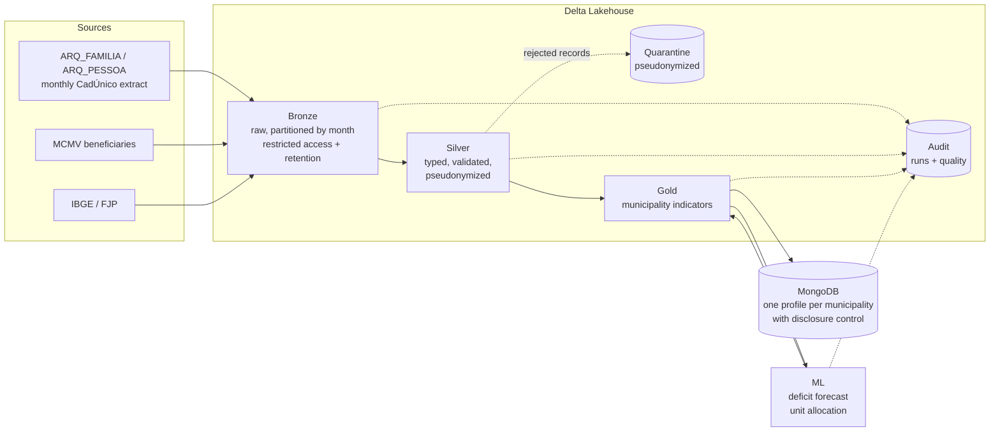

# Housing Lakehouse: Brazil's social registry × social housing programs

A data pipeline that joins **CadÚnico** (Brazil's registry of low-income families, ~95 million people) with **Minha Casa, Minha Vida** (MCMV, the national social housing program) contracts to answer three public policy questions:

1. **Where is housing precariousness?** Housing deficit and inadequacy per municipality, estimated monthly from CadÚnico.
2. **Do contracts reach the people who need them?** MCMV targeting by program and municipality, with flags for review.
3. **Where should the next units go?** Deficit forecast (ML) and unit allocation under a budget (optimization).

All of it while handling personal data of tens of millions of vulnerable people **under the LGPD** (Brazil's GDPR-like data protection law): identifiers never leave the raw layer, CPFs (taxpayer IDs) become keyed pseudonyms, and published data goes through statistical disclosure control.

> **Synthetic data only.** This repository contains no real data. A generator produces files in the official CadÚnico extract layout (66 family columns, ISO-8859-1, `;`-separated), with CPF and NIS numbers that have valid check digits and with defects injected on purpose. Any numbers from a local run describe the synthetic data, not reality.

## Architecture



Orchestrated by **Airflow** (monthly DAG with sensor, retries, failure alert and a monitoring task) or **Azure Data Factory** (pipeline provisioned with Terraform). Processing is **PySpark + Delta Lake**, locally or on **Databricks**. Details in [docs/architecture.md](docs/architecture.md).

## What the project covers

| Topic | Implementation | Where |
|---|---|---|
| Reliable ingestion | Layout check on the header; one partition per month written with `replaceWhere` (reruns are idempotent); corrupt rows flagged without failing the load; already ingested files skipped | [bronze.py](src/housing_lakehouse/layers/bronze.py) |
| Incremental load | Silver only processes months without a recorded success in the audit table, in order; families and persons are `MERGE`d (latest update wins, unchanged rows are not rewritten) | [silver.py](src/housing_lakehouse/layers/silver.py), [storage.py](src/housing_lakehouse/storage.py) |
| Data quality | Declarative rules (blocking and warning), quarantine with the reason for every rejection, per-rule metrics from a single aggregation, **circuit breaker** that stops the load when rejections exceed 5% | [quality.py](src/housing_lakehouse/quality.py) |
| Privacy (LGPD) | Per-column catalog (category + action) as the single source of the policy; HMAC-SHA256 with the key in Key Vault; minimization; generalization (ZIP → 5 digits, birth date → age); bronze retention; small-cell suppression; Unity Catalog tags | [layouts.py](src/housing_lakehouse/layouts.py), [governance/](src/housing_lakehouse/governance), [docs/lgpd.md](docs/lgpd.md) |
| Observability | Structured JSON logs; audit row for every run (status, duration, volumes, error); alerts on failure, unusual volume and stale data (Teams/Slack webhook); Log Analytics and a metric alert on Azure | [observability.py](src/housing_lakehouse/observability.py), [main.tf](infra/terraform/main.tf) |
| Modeling | Medallion layers; municipality indicators following the official housing deficit methodology (Fundação João Pinheiro) adapted to CadÚnico | [housing_rules.py](src/housing_lakehouse/housing_rules.py), [gold.py](src/housing_lakehouse/layers/gold.py) |
| Predictive ML | Gradient boosting that estimates the FJP relative deficit from CadÚnico; cross-validation **grouped by state** against a linear baseline; MLflow | [forecast.py](src/housing_lakehouse/ml/forecast.py) |
| Prescriptive ML | Mixed-integer linear programming (HiGHS): maximizes precariousness-weighted delivery under budget, delivery capacity and a minimum share per region | [allocation.py](src/housing_lakehouse/ml/allocation.py) |
| NoSQL | One profile per municipality in MongoDB, idempotent upsert and indexes | [mongo.py](src/housing_lakehouse/publishing/mongo.py) |
| Orchestration | Airflow DAG (local or Databricks executor) and an ADF pipeline with a monthly trigger | [dags/](dags/housing_lakehouse.py), [main.tf](infra/terraform/main.tf) |
| Infrastructure as code | Terraform: ADLS Gen2 (one container per layer, no shared keys, retention policy), Key Vault with access auditing, Databricks premium + Unity Catalog access connector, ADF with managed identity, Log Analytics, alerting | [infra/terraform/](infra/terraform) |
| CI | GitHub Actions: ruff, tests on real Spark, LGPD catalog in sync with the code, DAG integrity, `terraform validate`, wheel build | [ci.yml](.github/workflows/ci.yml) |

## Running it

Requires Linux or macOS with Java 17+, or Docker. On Windows, Spark needs Hadoop's `winutils.exe`; use Docker or WSL.

```bash
# with Docker (includes MongoDB)
cp .env.example .env
docker compose run --rm app housing generate-data   # ~20k families, 2 months
docker compose run --rm app housing pipeline        # bronze → silver → gold → ml → MongoDB
docker compose run --rm app housing monitor         # latest runs and freshness
docker compose run --rm app pytest

# without Docker
python -m venv .venv && source .venv/bin/activate
pip install -e ".[dev,ml]"
export PSEUDONYMIZATION_KEY=any-key-with-at-least-32-characters
housing generate-data && housing pipeline
```

Each step also runs on its own (`housing bronze`, `silver --table families`, `gold`, `ml`, `publish`, `retention`, `catalog`) and accepts `--run-id` to correlate with the orchestrator.

## Design decisions

- **HMAC pseudonymization in a pandas UDF, not with native `sha2`.** HMAC can be written with native Spark functions only (faster), but the key-derived blocks would appear as literals in the query plan, visible in the Spark UI and event logs. The UDF receives the key through its closure and the plan shows only the function name.
- **Domain separation in the HMAC** (`cpf:…`, `nis:…`): two different documents with the same digits never share a pseudonym.
- **Invalid documents get no pseudonym.** A CPF with a wrong check digit cannot accidentally join with anyone; it becomes `cpf_status = invalid` and is counted as a warning.
- **Quarantine is already pseudonymized** and does not keep the raw line of corrupt records, so failures can be investigated without access to bronze.
- **Deduplicate before MERGE.** Delta rejects a MERGE with duplicate keys in the source; the duplicate goes to quarantine with the reason `unique_record`.
- **Typing with `try_cast` / `try_to_timestamp`.** Spark 4 turns ANSI mode on by default, where one bad value would fail the whole job. Here it becomes null, is listed in `_invalid_types` and is handled by the rules.
- **Cross-validation grouped by state.** A random K-fold would put neighboring municipalities in both train and test and inflate R². Grouping by state measures generalization to regions the model has not seen.
- **Source column names stay in Portuguese.** They mirror the official CadÚnico layout, so real files load unchanged; from silver on, every name is English.
- **Explicit retention.** Bronze (with identifiers) is deleted after 3 months (`housing retention`), and the landing zone after 90 days through a storage lifecycle policy.

## Layout

```
src/housing_lakehouse/
  layouts.py            source layouts + per-column LGPD catalog
  layers/               bronze, silver, gold
  governance/           documents (CPF/NIS/IBGE), pseudonymization, policy, catalog, disclosure control
  quality.py            rules, quarantine, circuit breaker
  observability.py      logs, audit, alerts, volume, freshness
  housing_rules.py      housing deficit (FJP methodology) and MCMV income bands
  ml/                   forecast and allocation
  publishing/           MongoDB
  synthetic/            synthetic data generator
dags/                   Airflow
infra/terraform/        Azure
docs/                   architecture, LGPD, generated catalog
tests/                  unit + end-to-end with a personal data leak scan
```

## Next steps

- Natural language assistant (generative AI) that writes SQL **only against gold**, which is aggregated and holds no personal data, with query validation before execution.
- Column masks and row filters in Unity Catalog driven by the tags from `unity_catalog_tag_sql`.
- Complementary suppression in disclosure control (today it is primary only).
- Private endpoints for storage and Key Vault.

## Glossary

| Term | Meaning |
|---|---|
| CadÚnico | Brazil's single registry of low-income families, the entry point to most social programs |
| MCMV | Minha Casa, Minha Vida, the federal social housing program (FAR, FDS, PNHR and FGTS are its funding lines) |
| CPF / NIS | Taxpayer ID / social program ID |
| IBGE | Brazilian Institute of Geography and Statistics (municipality codes, population) |
| FJP | Fundação João Pinheiro, publisher of Brazil's official housing deficit figures |
| LGPD | Lei Geral de Proteção de Dados, Brazil's data protection law |
