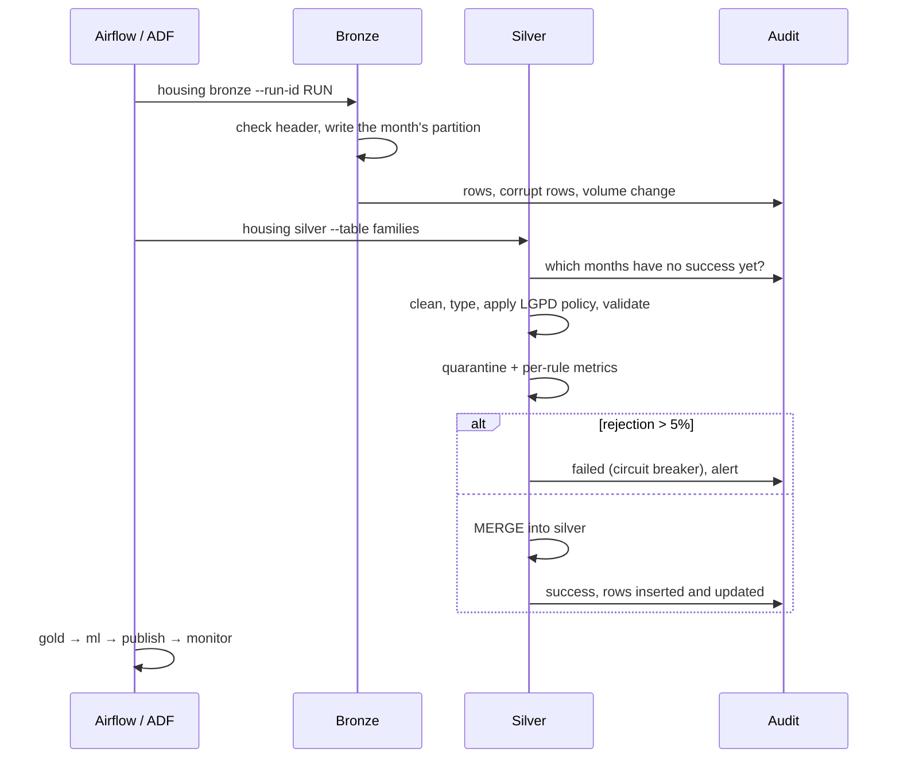

# Architecture

## Layers

| Layer | Content | Write mode | Who can read |
|---|---|---|---|
| `bronze` | The file as received, every column as text, + `_source_file`, `_reference_date`, `_record_hash`, `_corrupt_record` | One partition per month with `replaceWhere` | Pipeline identity only |
| `silver` | Typed, validated, LGPD policy applied, English column names | `MERGE` (families, persons) or overwrite (snapshots and references) | Data engineering and data science |
| `quarantine` | Rejected records, already pseudonymized, with `_failures` (reasons) and `_invalid_types` | One partition per month | Data engineering |
| `gold` | Municipality indicators, forecast, allocation, review flags (pseudonymized) | Overwrite | Analysts; `review_flags` restricted |
| `audit` | `runs` (one row per step and table) and `quality` (one row per rule) | Append | Everyone (no personal data) |

Locally each layer is a folder; on Azure, an ADLS container (`HOUSING_LAKEHOUSE=abfss://{layer}@account.dfs.core.windows.net/housing`), which allows permissions per layer.

## A monthly load

## Gold tables

| Table | Grain | Highlights |
|---|---|---|
| `municipality_precariousness` | municipality | families in deficit per component (precarious housing, cohabitation, rent burden, overcrowding), 6 inadequacies, median per capita income, precariousness index 0–100 |
| `mcmv_targeting` | program × municipality | share of contracts whose family is in CadÚnico, share of families in deficit served, income above band, CPF with more than one contract |
| `review_flags` | contract | CPF pseudonym + reasons; input for review, not a conclusion |
| `service_gap` | municipality | deficit (CadÚnico and FJP) × contracted units, coverage |
| `deficit_forecast` | municipality | forecast relative deficit (nowcast), out-of-fold prediction used for validation, residual |
| `unit_allocation` | municipality | units and investment suggested by the optimization |

## Orchestration

- **Airflow** ([dags/housing_lakehouse.py](../dags/housing_lakehouse.py)): sensor for the month's file, family and beneficiary silver steps in parallel, `monitor` always at the end (`all_done`), failure callback. With `HOUSING_EXECUTOR=databricks`, each task becomes a `DatabricksSubmitRunOperator` with the project wheel.
- **ADF** ([infra/terraform/main.tf](../infra/terraform/main.tf)): pipeline with one `DatabricksSparkPython` activity per step, retries, a monthly trigger and diagnostics in Log Analytics. The pseudonymization key reaches the cluster as `{{secrets/...}}`, never as plain text.

## Observability

| Signal | Where |
|---|---|
| Structured (JSON) log at the start and end of every step | stdout (collected by Databricks/Airflow) |
| Runs with status, duration, rows in, out and quarantined | `audit/runs` |
| Failures per quality rule on every load | `audit/quality` |
| Step failure | alert (webhook) + Airflow `on_failure_callback` + ADF metric alert |
| Unusual volume (> 20% from the median of the last 3 loads) | alert |
| Table without a new load for more than 45 days | `housing monitor` |
| Access to the pseudonymization key | Key Vault `AuditEvent` in Log Analytics |
